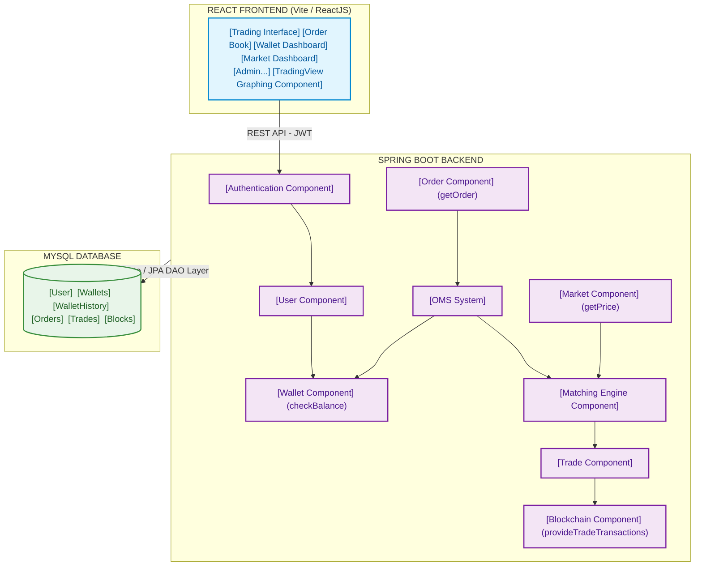

# 🚀 Blockchain Trading Platform (W-Coin Simulator)

> **Simulated Electronic Trading System & Blockchain Audit Logging**  
> A research and development project simulating core automated order matching engine mechanisms, secure balance management preventing **Double Spending** via **Pessimistic Locking**, and transparent transaction record storage using an immutable **Blockchain Audit Log** structure.

---

## 📌 1. Project Overview

The **Blockchain Trading Platform** was built to simulate the fundamental components of a modern digital asset trading platform. The system allows users to execute Buy/Sell orders via an automated matching engine, while freezing and recording matched transactions into a simulated Blockchain structure for auditing and data verification.

### Scope & Constraints
* **Simulated Market:** Supports a single asset (**W-Coin**). No external market data integration (Binance, Coinbase, etc.).
* **Order Types:** Supports **Limit Orders** (liquidity creation awaiting execution at a specified price) and **Market Orders** (instant execution against the current market price).
* **Blockchain Mechanism:** Implemented as a simulated **SHA-256 Hash Audit Log** stored in a relational database. Does not implement P2P distributed networks, Mining, or Smart Contracts.
* **Transactions:** Designed strictly for educational and research purposes; does not support real fiat deposits/withdrawals or payment gateway integrations.

---

## 🏗 2. System Architecture

The system is designed following a **Component-Based Architecture** comprising three main layers:





## 🛠 3. Tech Stack & Dependencies

* **Backend:** Java 21, Spring Boot 3.5.x, Spring Security 6.5.x, Spring Data JPA, JWT (`jjwt` 0.12.x), Maven, MySQL Connector/J (9.3.x).
* **Frontend:** ReactJS 19.x (Bundled with **Vite**), React Router DOM (7.x), Axios, Tailwind CSS, TradingView Lightweight Charts (5.x), React Toastify.
* **Database:** MySQL 8.x.
* **Testing & Tools:** Mockito, JUnit 5, H2 In-Memory DB, Postman, IDE (IntelliJ IDEA / VS Code).

---

## 👥 4. Role Matrix & User Guide

The system defines two main roles: **USER** and **ADMIN**.

### 📱 1. User Interface
* **Registration & Authentication:**
  * Users register using an Email and Password.
  * Successful login directs users directly to the **User Dashboard**.
  * **Forgot Password:** Users enter their registered email to receive a newly generated password sent via Spring Mail. Users must log in again using this supplied password.
* **Dashboard & Wallet Management:**
  * Top Navigation Bar includes 3 primary tabs: **Account** (view owned W-Coin balance), **History Trade** (view personal execution history), and **Market** (trading interface).
  * Each User automatically receives a single Wallet credited with W-Coins upon registration.
* **Trading (Market Page):**
  * Authentication is required to access trading features.
  * **Limit Order:** Place an order at a specific price, queued until market prices touch the target.
  * **Market Order:** Instantly execute an order against the current market price by filling existing orders in the Order Book.
* **History Trade:** Displays a list of executed trades. Clicking an individual trade opens a detailed modal popup.

### 🛡 2. Admin Interface
* **Admin Dashboard:** Provides an administrative interface allowing Admins to manage User accounts (Lock/Unlock), monitor Wallet balances, review full transaction history, and inspect the **Blockchain Audit Log**. *(Admins are restricted from placing trading orders)*.

---

## 🚀 5. Installation & Setup Guide

### Prerequisites
1. **Java Development Kit (JDK 21):** [Download JDK 21 from Oracle](https://www.oracle.com/asean/java/technologies/downloads/#java21)
2. **Node.js Environment:** [Download Node.js (v18+ recommended)](https://nodejs.org/en/download)
3. **MySQL Database Server:** Installed and running locally or remotely.
4. **IDE:** IntelliJ IDEA or Visual Studio Code.

### Installation Steps

#### Step 1: Database Initialization (MySQL)
1. Open your MySQL client (Workbench, Navicat, or MySQL CLI).
2. Create a target database and execute the project schema and mock data scripts:
   ```sql
   -- Execute schema.sql and mockdata.sql files provided in the repository
   CREATE DATABASE trading_db;
   USE trading_db;
   -- Run SQL scripts...


#### Step 2: Configure & Launch Backend (Spring Boot)

1. Open the `backend` folder in your IDE.
2. Reload Maven dependencies defined in `pom.xml`.
3. Create a `.env` file in the project root/backend directory (or configure `application.properties`):
```env
DB_URL=jdbc:mysql://localhost:3306/trading_db?createDatabaseIfNotExist=true
DB_USERNAME=root
DB_PASSWORD=your_mysql_password
JWT_SECRET=your_jwt_secret_key_here
MAIL_USERNAME=your_email@gmail.com
MAIL_PASSWORD=your_app_password

```


4. Run the Spring Boot application class (`Application.java`).

#### Step 3: Configure & Launch Frontend (React + Vite)

1. Open a terminal in the `frontend` directory.
2. Install node dependencies:
```bash
npm install
# Or: npm install ci

```


3. Run the development server via Vite:
```bash
npm run dev

```


4. Access the application in your browser at `http://localhost:5173` (or `http://localhost:3000`).

---

## 🏆 6. Key Achievements

1. **Automated Matching Engine & Order Book Management:**
* Designed an automated Buy/Sell order matching engine for a single coin adhering strictly to **Price-Time Priority** (Best Price ➔ First-Come, First-Served).
* Seamlessly handles order state lifecycles: `OPEN` (Pending), `PARTIAL` (Partially Filled), `FILLED` (Fully Executed), and `CANCELLED`.


2. **Data Concurrency Protection via Pessimistic Locking:**
* Applied `@Lock(LockModeType.PESSIMISTIC_WRITE)` directly at the database repository level for Wallet balances and Order Book records.
* **Impact:** Prevents race conditions when multiple users issue concurrent buy/sell requests within the same millisecond. Completely eliminates negative balance risks and **Double Spending**.


3. **Automated Transaction Audit Logging (Blockchain Simulation):**
* Utilized JPA Event Listeners combined with Reflection to capture transaction details and user identities from JWT tokens whenever Wallet or Order data changes.
* **Fail-safe Mechanism:** Enclosed within exception handling blocks to guarantee that logging errors never disrupt primary trading operations.


4. **Secure Spring Boot (Java 21) Backend:**
* API endpoints secured via stateless JWT authentication filters.
* Sensitive environmental credentials (`JWT_SECRET`, database passwords) externalized via `dotenv-java` and excluded from source control.
* Asynchronous email notifications (`@EnableAsync`) for password recovery via Spring Mail.


5. **Optimized ReactJS (Hooks) Frontend:**
* Developed using modern **React Hooks** (`useState`, `useEffect`, Custom Hooks) for responsive trading UI management.
* Robust client-side form validations to prevent invalid payload dispatching.


6. **Robust Testing Suite:**
* Utilized **Mockito** for rapid, isolated unit testing of matching service logic without starting database containers.


---

## 🔮 7. Future Roadmap

1. **Real-Time Communication (WebSocket / STOMP):**
* Transition from **HTTP Polling** to **Spring WebSocket (STOMP)** or **Netty**.
* Push real-time Order Book and Trade execution updates to clients instantly, reducing network latency from seconds to milliseconds.


2. **In-Memory Matching Engine:**
* Elevate the Order Book structure into RAM using concurrent data structures (`ConcurrentSkipListMap` / Red-Black Trees) to bypass disk I/O bottlenecks and support high throughput.


3. **Advanced Database Architecture & Distributed Locking:**
* Integrate **Redis / Redlock** for memory-speed wallet locking and caching, resolving database Lock Wait Timeouts during high traffic spikes.

---

## 📚 References & Resources

### 🔗 Online Tutorials & Articles
* [Understanding Matching Engines in Trading](https://www.binance.com/en/academy/articles/understanding-matching-engines-in-trading) – Binance Academy
* [Mockito Tutorial](https://www.tutorialspoint.com/mockito/index.htm) – TutorialsPoint
* [React Context API Explained with Examples](https://www.freecodecamp.org/news/react-context-api-explained-with-examples/) – freeCodeCamp
* [Spring Boot 3.0 JWT Authentication with Spring Security using MySQL Database](https://www.geeksforgeeks.org/springboot/spring-boot-3-0-jwt-authentication-with-spring-security-using-mysql-database/) – GeeksforGeeks
* [PriorityQueue in Java](https://www.geeksforgeeks.org/java/priority-queue-in-java/) – GeeksforGeeks
* [Bid and Ask Definition & Example](https://www.investopedia.com/terms/b/bid-and-ask.asp) – Investopedia
* [Pessimistic Locking in JPA](https://www.baeldung.com/jpa-pessimistic-locking) – Baeldung
* [Optimistic Lock và Pessimistic Lock](https://viblo.asia/p/009-optimistic-lock-va-pessimistic-lock-L4x5xr7aZBM) – Viblo
* [Java Record Keyword](https://www.baeldung.com/java-record-keyword) – Baeldung
* [What is OAuth 2.0?](https://auth0.com/intro-to-iam/what-is-oauth-2) – Auth0

### 📖 Frameworks, Protocols & Official Documentation
* [Spring Boot Documentation](https://spring.io/projects/spring-boot)
* [Spring Security Documentation](https://spring.io/projects/spring-security)
* [Spring Data JPA Documentation](https://spring.io/projects/spring-data-jpa)
* [Java Concurrency / LinkedBlockingQueue](https://docs.oracle.com/en/java/javase/21/docs/api/java.base/java/util/concurrent/LinkedBlockingQueue.html)
* [React Documentation](https://react.dev/)
* [Binance API Documentation](https://binance-docs.github.io/apidocs/spot/en/)
* [JUnit 5 User Guide](https://junit.org/junit5/docs/current/user-guide/)
* [TradingView Lightweight Charts Tutorials & Docs](https://tradingview.github.io/lightweight-charts/docs)